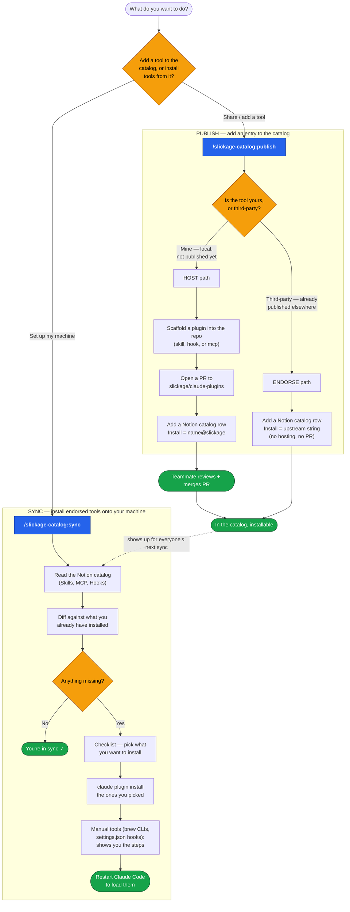

# slickage-catalog — which command, and what happens

Two commands. **`publish`** adds something to the team catalog. **`sync`** installs
from it. The diagram below renders on GitHub and in Notion (paste into a `mermaid`
code block).

## When to use which

| You want to… | Command | What happens |
|--------------|---------|--------------|
| Share a skill/hook/MCP **you wrote** | `publish` (HOST) | scaffolds it into the repo, opens a PR, adds a Notion row → installable as `@slickage` once merged |
| Recommend a **third-party** tool the team should know about | `publish` (ENDORSE) | adds a Notion row pointing at its upstream install string — no hosting |
| Get the team's endorsed tools **onto your machine** | `sync` | reads the catalog, shows what you're missing, installs the ones you pick |

`publish` picks HOST vs ENDORSE automatically: `--from <local-folder>` (or a new one
you describe) → HOST; `--source <upstream-install/URL>` → ENDORSE; it asks if you
give neither.

## Prerequisites

- **Both commands** need the **Notion MCP** connected (the catalog lives in Notion).
- **`publish` HOST path** also needs `gh` authenticated + a clone of
  `slickage/claude-plugins`.
- **`sync`** also needs the `claude` CLI on your PATH.

## The one-line mental model

> **Notion is the catalog (source of truth). `publish` writes to it. `sync` reads from
> it.** Hosting in `slickage/claude-plugins` is just how *our own* tools get an install
> string; third-party tools keep theirs.
